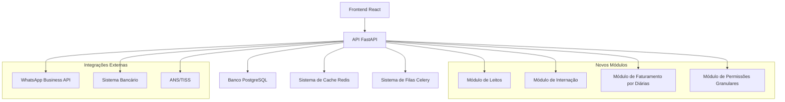

# Arquitetura Técnica - Sistema de Leitos e Internação
## DataClínica - Clínicas de Dependentes Químicos e Saúde Mental

---

## 1. Arquitetura Geral



## 2. Estrutura de Dados Detalhada

### 2.1 Modelo de Dados Completo

```python
# models.py - Novos modelos para o sistema

from sqlalchemy import Column, Integer, String, DateTime, Text, Boolean, ForeignKey, Date, Numeric, JSON, Time
from sqlalchemy.ext.declarative import declarative_base
from sqlalchemy.orm import relationship
from datetime import datetime

# ============================================================================
# SISTEMA DE LEITOS E QUARTOS
# ============================================================================

class Department(Base):
    """Departamentos/Setores da clínica"""
    __tablename__ = "departments"
    
    id = Column(Integer, primary_key=True, index=True)
    clinic_id = Column(Integer, ForeignKey("clinics.id"), nullable=False)
    name = Column(String(100), nullable=False)  # Masculino, Feminino, Misto, UTI, Isolamento
    code = Column(String(20), unique=True, index=True)
    description = Column(Text)
    capacity = Column(Integer, default=0)  # Capacidade total de leitos
    floor = Column(String(10))
    responsible_user_id = Column(Integer, ForeignKey("users.id"))
    is_active = Column(Boolean, default=True)
    created_at = Column(DateTime, default=datetime.utcnow)
    
    # Relacionamentos
    clinic = relationship("Clinic")
    responsible = relationship("User")
    rooms = relationship("Room", back_populates="department")

class Room(Base):
    """Quartos da clínica"""
    __tablename__ = "rooms"
    
    id = Column(Integer, primary_key=True, index=True)
    clinic_id = Column(Integer, ForeignKey("clinics.id"), nullable=False)
    department_id = Column(Integer, ForeignKey("departments.id"), nullable=False)
    room_number = Column(String(20), nullable=False)
    room_name = Column(String(100))
    room_type = Column(String(50))  # standard, suite, isolamento, observacao, uti
    capacity = Column(Integer, default=1)  # número máximo de leitos
    floor = Column(String(10))
    area_m2 = Column(Numeric(8, 2))  # Área em metros quadrados
    
    # Comodidades
    has_bathroom = Column(Boolean, default=True)
    has_air_conditioning = Column(Boolean, default=False)
    has_tv = Column(Boolean, default=False)
    has_phone = Column(Boolean, default=False)
    has_internet = Column(Boolean, default=False)
    has_balcony = Column(Boolean, default=False)
    
    # Controle
    is_active = Column(Boolean, default=True)
    maintenance_notes = Column(Text)
    last_cleaning = Column(DateTime)
    next_maintenance = Column(DateTime)
    
    created_at = Column(DateTime, default=datetime.utcnow)
    updated_at = Column(DateTime, default=datetime.utcnow, onupdate=datetime.utcnow)
    
    # Relacionamentos
    clinic = relationship("Clinic")
    department = relationship("Department", back_populates="rooms")
    beds = relationship("Bed", back_populates="room")

class Bed(Base):
    """Leitos individuais"""
    __tablename__ = "beds"
    
    id = Column(Integer, primary_key=True, index=True)
    clinic_id = Column(Integer, ForeignKey("clinics.id"), nullable=False)
    room_id = Column(Integer, ForeignKey("rooms.id"), nullable=False)
    bed_number = Column(String(20), nullable=False)  # Número único do leito
    bed_code = Column(String(50), unique=True, index=True)  # Código completo: SETOR-QUARTO-LEITO
    
    # Tipo e características
    bed_type = Column(String(50))  # standard, uti, isolamento, observacao
    bed_category = Column(String(50))  # masculino, feminino, misto
    
    # Status operacional
    status = Column(String(50), default="available")  # available, occupied, maintenance, reserved, blocked, cleaning
    status_reason = Column(Text)  # Motivo do status atual
    status_changed_at = Column(DateTime, default=datetime.utcnow)
    status_changed_by = Column(Integer, ForeignKey("users.id"))
    
    # Paciente atual
    current_patient_id = Column(Integer, ForeignKey("patients.id"))
    current_admission_id = Column(Integer, ForeignKey("patient_admissions.id"))
    
    # Manutenção e limpeza
    last_cleaning = Column(DateTime)
    last_maintenance = Column(DateTime)
    next_maintenance = Column(DateTime)
    maintenance_notes = Column(Text)
    
    # Equipamentos
    has_oxygen = Column(Boolean, default=False)
    has_suction = Column(Boolean, default=False)
    has_monitor = Column(Boolean, default=False)
    equipment_notes = Column(Text)
    
    is_active = Column(Boolean, default=True)
    created_at = Column(DateTime, default=datetime.utcnow)
    updated_at = Column(DateTime, default=datetime.utcnow, onupdate=datetime.utcnow)
    
    # Relacionamentos
    clinic = relationship("Clinic")
    room = relationship("Room", back_populates="beds")
    current_patient = relationship("Patient")
    current_admission = relationship("PatientAdmission", foreign_keys=[current_admission_id])
    status_changer = relationship("User")
    admissions = relationship("PatientAdmission", back_populates="bed", foreign_keys="PatientAdmission.bed_id")
    status_history = relationship("BedStatusHistory", back_populates="bed")

class BedStatusHistory(Base):
    """Histórico de mudanças de status dos leitos"""
    __tablename__ = "bed_status_history"
    
    id = Column(Integer, primary_key=True, index=True)
    bed_id = Column(Integer, ForeignKey("beds.id"), nullable=False)
    previous_status = Column(String(50))
    new_status = Column(String(50), nullable=False)
    reason = Column(Text)
    changed_by = Column(Integer, ForeignKey("users.id"), nullable=False)
    changed_at = Column(DateTime, default=datetime.utcnow)
    
    # Relacionamentos
    bed = relationship("Bed", back_populates="status_history")
    user = relationship("User")

# ============================================================================
# SISTEMA DE INTERNAÇÃO
# ============================================================================

class PatientAdmission(Base):
    """Internações de pacientes"""
    __tablename__ = "patient_admissions"
    
    id = Column(Integer, primary_key=True, index=True)
    clinic_id = Column(Integer, ForeignKey("clinics.id"), nullable=False)
    patient_id = Column(Integer, ForeignKey("patients.id"), nullable=False)
    bed_id = Column(Integer, ForeignKey("beds.id"), nullable=False)
    
    # Identificação
    admission_number = Column(String(50), unique=True, index=True)
    admission_date = Column(DateTime, nullable=False)
    expected_discharge_date = Column(DateTime)
    actual_discharge_date = Column(DateTime)
    
    # Tipo de internação
    admission_type = Column(String(50), nullable=False)  # voluntary, involuntary, judicial, emergency
    admission_reason = Column(Text)  # Motivo da internação
    referring_doctor = Column(String(200))  # Médico que encaminhou
    referring_institution = Column(String(200))  # Instituição que encaminhou
    
    # Pagamento
    payment_type = Column(String(50), nullable=False)  # sus, insurance, private
    insurance_plan_id = Column(Integer, ForeignKey("insurance_plans.id"))
    insurance_authorization = Column(String(100))  # Número de autorização
    daily_rate_config_id = Column(Integer, ForeignKey("daily_rate_configs.id"), nullable=False)
    
    # Status da internação
    status = Column(String(50), default="active")  # active, discharged, transferred, deceased, escaped
    
    # Alta/Saída
    discharge_type = Column(String(50))  # medical_discharge, voluntary_discharge, transfer, death, escape
    discharge_reason = Column(Text)
    discharge_destination = Column(String(200))  # Para onde foi transferido
    discharge_notes = Column(Text)
    discharged_by = Column(Integer, ForeignKey("users.id"))
    
    # Cálculos financeiros
    total_days = Column(Integer, default=0)
    total_amount = Column(Numeric(15, 2), default=0)
    amount_paid = Column(Numeric(15, 2), default=0)
    amount_pending = Column(Numeric(15, 2), default=0)
    
    # Controle
    created_by = Column(Integer, ForeignKey("users.id"), nullable=False)
    created_at = Column(DateTime, default=datetime.utcnow)
    updated_at = Column(DateTime, default=datetime.utcnow, onupdate=datetime.utcnow)
    
    # Relacionamentos
    clinic = relationship("Clinic")
    patient = relationship("Patient")
    bed = relationship("Bed", back_populates="admissions", foreign_keys=[bed_id])
    insurance_plan = relationship("InsurancePlan")
    daily_rate_config = relationship("DailyRateConfig")
    creator = relationship("User", foreign_keys=[created_by])
    discharger = relationship("User", foreign_keys=[discharged_by])
    billing_records = relationship("AdmissionBilling", back_populates="admission")
    transfers = relationship("BedTransfer", back_populates="admission")

class BedTransfer(Base):
    """Transferências de leito"""
    __tablename__ = "bed_transfers"
    
    id = Column(Integer, primary_key=True, index=True)
    admission_id = Column(Integer, ForeignKey("patient_admissions.id"), nullable=False)
    from_bed_id = Column(Integer, ForeignKey("beds.id"), nullable=False)
    to_bed_id = Column(Integer, ForeignKey("beds.id"), nullable=False)
    transfer_date = Column(DateTime, default=datetime.utcnow)
    transfer_reason = Column(Text, nullable=False)
    authorized_by = Column(Integer, ForeignKey("users.id"), nullable=False)
    notes = Column(Text)
    
    # Relacionamentos
    admission = relationship("PatientAdmission", back_populates="transfers")
    from_bed = relationship("Bed", foreign_keys=[from_bed_id])
    to_bed = relationship("Bed", foreign_keys=[to_bed_id])
    authorizer = relationship("User")

# ============================================================================
# SISTEMA DE DIÁRIAS VARIÁVEIS
# ============================================================================

class DailyRateConfig(Base):
    """Configuração de diárias por tipo de pagamento"""
    __tablename__ = "daily_rate_configs"
    
    id = Column(Integer, primary_key=True, index=True)
    clinic_id = Column(Integer, ForeignKey("clinics.id"), nullable=False)
    config_name = Column(String(100), nullable=False)
    description = Column(Text)
    
    # Tipo de pagamento
    payment_type = Column(String(50), nullable=False)  # sus, insurance, private
    insurance_plan_id = Column(Integer, ForeignKey("insurance_plans.id"))  # null para SUS e particular
    
    # Configurações gerais
    is_active = Column(Boolean, default=True)
    effective_date = Column(Date, nullable=False)  # Data de início da vigência
    expiry_date = Column(Date)  # Data de fim da vigência
    
    # Controle
    created_by = Column(Integer, ForeignKey("users.id"), nullable=False)
    created_at = Column(DateTime, default=datetime.utcnow)
    updated_at = Column(DateTime, default=datetime.utcnow, onupdate=datetime.utcnow)
    
    # Relacionamentos
    clinic = relationship("Clinic")
    insurance_plan = relationship("InsurancePlan")
    creator = relationship("User")
    rate_tiers = relationship("DailyRateTier", back_populates="config")
    admissions = relationship("PatientAdmission", back_populates="daily_rate_config")

class DailyRateTier(Base):
    """Faixas de diárias por tempo de internação"""
    __tablename__ = "daily_rate_tiers"
    
    id = Column(Integer, primary_key=True, index=True)
    config_id = Column(Integer, ForeignKey("daily_rate_configs.id"), nullable=False)
    
    # Definição da faixa
    tier_name = Column(String(100), nullable=False)  # "1-30 dias", "31-60 dias", etc.
    tier_order = Column(Integer, nullable=False)  # Ordem das faixas
    min_days = Column(Integer, nullable=False)  # 1, 31, 61, 91
    max_days = Column(Integer)  # 30, 60, 90, 120 (null para última faixa)
    
    # Valores
    daily_rate = Column(Numeric(10, 2), nullable=False)
    weekend_rate = Column(Numeric(10, 2))  # Taxa diferenciada para fins de semana
    holiday_rate = Column(Numeric(10, 2))  # Taxa diferenciada para feriados
    
    # Configurações adicionais
    description = Column(Text)
    includes_meals = Column(Boolean, default=True)
    includes_medication = Column(Boolean, default=False)
    includes_therapy = Column(Boolean, default=False)
    
    # Relacionamentos
    config = relationship("DailyRateConfig", back_populates="rate_tiers")

# ============================================================================
# SISTEMA DE FATURAMENTO POR INTERNAÇÃO
# ============================================================================

class AdmissionBilling(Base):
    """Faturamento de internações"""
    __tablename__ = "admission_billing"
    
    id = Column(Integer, primary_key=True, index=True)
    clinic_id = Column(Integer, ForeignKey("clinics.id"), nullable=False)
    admission_id = Column(Integer, ForeignKey("patient_admissions.id"), nullable=False)
    
    # Período de faturamento
    billing_period_start = Column(Date, nullable=False)
    billing_period_end = Column(Date, nullable=False)
    days_in_period = Column(Integer, nullable=False)
    
    # Cálculos
    daily_rate_applied = Column(Numeric(10, 2), nullable=False)
    base_amount = Column(Numeric(15, 2), nullable=False)  # Valor base das diárias
    additional_charges = Column(Numeric(15, 2), default=0)  # Taxas adicionais
    discounts = Column(Numeric(15, 2), default=0)  # Descontos aplicados
    total_amount = Column(Numeric(15, 2), nullable=False)  # Valor total
    
    # Status do faturamento
    billing_status = Column(String(50), default="pending")  # pending, billed, paid, cancelled, disputed
    billing_date = Column(DateTime)
    due_date = Column(Date)
    payment_date = Column(DateTime)
    
    # Detalhes do pagamento
    payment_method = Column(String(50))  # cash, card, transfer, insurance
    payment_reference = Column(String(100))  # Número do comprovante/autorização
    
    # Observações
    notes = Column(Text)
    internal_notes = Column(Text)  # Notas internas não visíveis ao paciente
    
    # Controle
    created_by = Column(Integer, ForeignKey("users.id"), nullable=False)
    created_at = Column(DateTime, default=datetime.utcnow)
    updated_at = Column(DateTime, default=datetime.utcnow, onupdate=datetime.utcnow)
    
    # Relacionamentos
    clinic = relationship("Clinic")
    admission = relationship("PatientAdmission", back_populates="billing_records")
    creator = relationship("User")
    billing_items = relationship("BillingItem", back_populates="admission_billing")

class BillingItem(Base):
    """Itens detalhados do faturamento"""
    __tablename__ = "billing_items"
    
    id = Column(Integer, primary_key=True, index=True)
    admission_billing_id = Column(Integer, ForeignKey("admission_billing.id"), nullable=False)
    
    # Descrição do item
    item_type = Column(String(50), nullable=False)  # daily_rate, medication, procedure, therapy
    item_description = Column(String(200), nullable=False)
    item_date = Column(Date, nullable=False)
    
    # Quantidades e valores
    quantity = Column(Numeric(10, 3), default=1)
    unit_price = Column(Numeric(10, 2), nullable=False)
    total_price = Column(Numeric(15, 2), nullable=False)
    
    # Relacionamentos
    admission_billing = relationship("AdmissionBilling", back_populates="billing_items")

# ============================================================================
# SISTEMA DE PERMISSÕES GRANULARES
# ============================================================================

class UserRole(Base):
    """Roles/Perfis de usuário"""
    __tablename__ = "user_roles"
    
    id = Column(Integer, primary_key=True, index=True)
    clinic_id = Column(Integer, ForeignKey("clinics.id"), nullable=False)
    role_name = Column(String(100), nullable=False)
    role_description = Column(Text)
    is_admin = Column(Boolean, default=False)  # Se é role de administrador
    is_system_role = Column(Boolean, default=False)  # Se é role do sistema (não pode ser deletada)
    is_active = Column(Boolean, default=True)
    
    created_by = Column(Integer, ForeignKey("users.id"), nullable=False)
    created_at = Column(DateTime, default=datetime.utcnow)
    
    # Relacionamentos
    clinic = relationship("Clinic")
    creator = relationship("User")
    permissions = relationship("RolePermission", back_populates="role")
    users = relationship("UserRoleAssignment", back_populates="role")

class Module(Base):
    """Módulos do sistema"""
    __tablename__ = "modules"
    
    id = Column(Integer, primary_key=True, index=True)
    module_name = Column(String(100), unique=True, nullable=False)
    module_display_name = Column(String(100), nullable=False)
    module_description = Column(Text)
    module_category = Column(String(50))  # clinical, administrative, financial, reports
    is_active = Column(Boolean, default=True)
    sort_order = Column(Integer, default=0)
    
    # Relacionamentos
    permissions = relationship("RolePermission", back_populates="module")

class RolePermission(Base):
    """Permissões por role e módulo"""
    __tablename__ = "role_permissions"
    
    id = Column(Integer, primary_key=True, index=True)
    role_id = Column(Integer, ForeignKey("user_roles.id"), nullable=False)
    module_id = Column(Integer, ForeignKey("modules.id"), nullable=False)
    
    # Permissões CRUD
    can_view = Column(Boolean, default=False)
    can_create = Column(Boolean, default=False)
    can_edit = Column(Boolean, default=False)
    can_delete = Column(Boolean, default=False)
    
    # Permissões especiais
    can_export = Column(Boolean, default=False)
    can_import = Column(Boolean, default=False)
    can_approve = Column(Boolean, default=False)
    can_configure = Column(Boolean, default=False)
    
    # Relacionamentos
    role = relationship("UserRole", back_populates="permissions")
    module = relationship("Module", back_populates="permissions")

class UserRoleAssignment(Base):
    """Atribuição de roles aos usuários"""
    __tablename__ = "user_role_assignments"
    
    id = Column(Integer, primary_key=True, index=True)
    user_id = Column(Integer, ForeignKey("users.id"), nullable=False)
    role_id = Column(Integer, ForeignKey("user_roles.id"), nullable=False)
    
    assigned_by = Column(Integer, ForeignKey("users.id"), nullable=False)
    assigned_at = Column(DateTime, default=datetime.utcnow)
    is_active = Column(Boolean, default=True)
    
    # Relacionamentos
    user = relationship("User", foreign_keys=[user_id])
    role = relationship("UserRole", back_populates="users")
    assigner = relationship("User", foreign_keys=[assigned_by])
```

## 3. APIs e Endpoints

### 3.1 Endpoints de Leitos e Quartos

```python
# routers/beds.py

from fastapi import APIRouter, Depends, HTTPException, Query
from sqlalchemy.orm import Session
from typing import List, Optional
from datetime import datetime, date

router = APIRouter(prefix="/beds", tags=["beds"])

@router.get("/occupancy-dashboard")
def get_occupancy_dashboard(
    db: Session = Depends(get_db),
    current_user: User = Depends(get_current_user)
):
    """Dashboard de ocupação de leitos"""
    clinic_id = current_user.clinic_id
    
    # Estatísticas gerais
    total_beds = db.query(Bed).filter(Bed.clinic_id == clinic_id, Bed.is_active == True).count()
    occupied_beds = db.query(Bed).filter(
        Bed.clinic_id == clinic_id,
        Bed.status == "occupied",
        Bed.is_active == True
    ).count()
    available_beds = db.query(Bed).filter(
        Bed.clinic_id == clinic_id,
        Bed.status == "available",
        Bed.is_active == True
    ).count()
    maintenance_beds = db.query(Bed).filter(
        Bed.clinic_id == clinic_id,
        Bed.status == "maintenance",
        Bed.is_active == True
    ).count()
    
    occupancy_rate = (occupied_beds / total_beds * 100) if total_beds > 0 else 0
    
    # Ocupação por departamento
    departments_occupancy = db.query(
        Department.name,
        func.count(Bed.id).label("total_beds"),
        func.sum(case([(Bed.status == "occupied", 1)], else_=0)).label("occupied_beds")
    ).join(Room).join(Bed).filter(
        Department.clinic_id == clinic_id,
        Bed.is_active == True
    ).group_by(Department.id, Department.name).all()
    
    return {
        "total_beds": total_beds,
        "occupied_beds": occupied_beds,
        "available_beds": available_beds,
        "maintenance_beds": maintenance_beds,
        "occupancy_rate": round(occupancy_rate, 2),
        "departments_occupancy": departments_occupancy
    }

@router.get("/", response_model=List[BedResponse])
def list_beds(
    skip: int = 0,
    limit: int = 100,
    department_id: Optional[int] = None,
    status: Optional[str] = None,
    room_id: Optional[int] = None,
    db: Session = Depends(get_db),
    current_user: User = Depends(get_current_user)
):
    """Listar leitos com filtros"""
    query = db.query(Bed).filter(
        Bed.clinic_id == current_user.clinic_id,
        Bed.is_active == True
    )
    
    if department_id:
        query = query.join(Room).filter(Room.department_id == department_id)
    
    if status:
        query = query.filter(Bed.status == status)
    
    if room_id:
        query = query.filter(Bed.room_id == room_id)
    
    beds = query.offset(skip).limit(limit).all()
    return beds

@router.put("/{bed_id}/status")
def update_bed_status(
    bed_id: int,
    status_update: BedStatusUpdate,
    db: Session = Depends(get_db),
    current_user: User = Depends(get_current_user)
):
    """Atualizar status do leito"""
    bed = db.query(Bed).filter(
        Bed.id == bed_id,
        Bed.clinic_id == current_user.clinic_id
    ).first()
    
    if not bed:
        raise HTTPException(status_code=404, detail="Leito não encontrado")
    
    # Registrar histórico
    history = BedStatusHistory(
        bed_id=bed_id,
        previous_status=bed.status,
        new_status=status_update.new_status,
        reason=status_update.reason,
        changed_by=current_user.id
    )
    db.add(history)
    
    # Atualizar status
    bed.status = status_update.new_status
    bed.status_reason = status_update.reason
    bed.status_changed_at = datetime.utcnow()
    bed.status_changed_by = current_user.id
    
    db.commit()
    db.refresh(bed)
    
    return {"message": "Status do leito atualizado com sucesso", "bed": bed}

@router.get("/available")
def get_available_beds(
    department_id: Optional[int] = None,
    bed_type: Optional[str] = None,
    db: Session = Depends(get_db),
    current_user: User = Depends(get_current_user)
):
    """Buscar leitos disponíveis para internação"""
    query = db.query(Bed).filter(
        Bed.clinic_id == current_user.clinic_id,
        Bed.status == "available",
        Bed.is_active == True
    )
    
    if department_id:
        query = query.join(Room).filter(Room.department_id == department_id)
    
    if bed_type:
        query = query.filter(Bed.bed_type == bed_type)
    
    beds = query.all()
    return beds
```

### 3.2 Endpoints de Internação

```python
# routers/admissions.py

@router.post("/", response_model=AdmissionResponse)
def create_admission(
    admission: AdmissionCreate,
    db: Session = Depends(get_db),
    current_user: User = Depends(get_current_user)
):
    """Criar nova internação"""
    # Verificar se o leito está disponível
    bed = db.query(Bed).filter(
        Bed.id == admission.bed_id,
        Bed.clinic_id == current_user.clinic_id,
        Bed.status == "available"
    ).first()
    
    if not bed:
        raise HTTPException(status_code=400, detail="Leito não disponível")
    
    # Gerar número de internação
    admission_number = generate_admission_number(db, current_user.clinic_id)
    
    # Criar internação
    db_admission = PatientAdmission(
        clinic_id=current_user.clinic_id,
        admission_number=admission_number,
        created_by=current_user.id,
        **admission.dict()
    )
    db.add(db_admission)
    
    # Atualizar status do leito
    bed.status = "occupied"
    bed.current_patient_id = admission.patient_id
    bed.current_admission_id = db_admission.id
    bed.status_changed_at = datetime.utcnow()
    bed.status_changed_by = current_user.id
    
    # Registrar histórico do leito
    history = BedStatusHistory(
        bed_id=bed.id,
        previous_status="available",
        new_status="occupied",
        reason=f"Internação do paciente {admission.patient_id}",
        changed_by=current_user.id
    )
    db.add(history)
    
    db.commit()
    db.refresh(db_admission)
    
    return db_admission

@router.put("/{admission_id}/discharge")
def discharge_patient(
    admission_id: int,
    discharge_data: DischargeData,
    db: Session = Depends(get_db),
    current_user: User = Depends(get_current_user)
):
    """Dar alta ao paciente"""
    admission = db.query(PatientAdmission).filter(
        PatientAdmission.id == admission_id,
        PatientAdmission.clinic_id == current_user.clinic_id,
        PatientAdmission.status == "active"
    ).first()
    
    if not admission:
        raise HTTPException(status_code=404, detail="Internação não encontrada")
    
    # Calcular dias de internação
    discharge_date = discharge_data.discharge_date or datetime.utcnow()
    total_days = (discharge_date.date() - admission.admission_date.date()).days + 1
    
    # Calcular valor total
    total_amount = calculate_admission_total(admission, total_days, db)
    
    # Atualizar internação
    admission.actual_discharge_date = discharge_date
    admission.discharge_type = discharge_data.discharge_type
    admission.discharge_reason = discharge_data.discharge_reason
    admission.discharge_notes = discharge_data.discharge_notes
    admission.discharged_by = current_user.id
    admission.status = "discharged"
    admission.total_days = total_days
    admission.total_amount = total_amount
    
    # Liberar leito
    bed = admission.bed
    bed.status = "available"
    bed.current_patient_id = None
    bed.current_admission_id = None
    bed.status_changed_at = datetime.utcnow()
    bed.status_changed_by = current_user.id
    
    # Registrar histórico do leito
    history = BedStatusHistory(
        bed_id=bed.id,
        previous_status="occupied",
        new_status="available",
        reason=f"Alta do paciente {admission.patient_id}",
        changed_by=current_user.id
    )
    db.add(history)
    
    # Gerar faturamento final
    generate_final_billing(admission, db)
    
    db.commit()
    db.refresh(admission)
    
    return {"message": "Alta realizada com sucesso", "admission": admission}

def calculate_admission_total(admission: PatientAdmission, total_days: int, db: Session) -> float:
    """Calcular valor total da internação baseado nas diárias"""
    config = admission.daily_rate_config
    total_amount = 0
    
    # Ordenar tiers por ordem
    tiers = sorted(config.rate_tiers, key=lambda x: x.tier_order)
    
    remaining_days = total_days
    
    for tier in tiers:
        if remaining_days <= 0:
            break
        
        # Calcular dias nesta faixa
        tier_days = min(remaining_days, tier.max_days - tier.min_days + 1 if tier.max_days else remaining_days)
        
        # Adicionar ao total
        total_amount += tier_days * float(tier.daily_rate)
        
        remaining_days -= tier_days
    
    return total_amount
```

## 4. Interface Frontend

### 4.1 Dashboard de Leitos

```typescript
// components/beds/BedsDashboard.tsx

import React, { useState, useEffect } from 'react';
import { Card, CardContent, CardHeader, CardTitle } from '@/components/ui/card';
import { Badge } from '@/components/ui/badge';
import { Button } from '@/components/ui/button';
import { Bed, Users, AlertTriangle, Wrench } from 'lucide-react';

interface BedOccupancyData {
  total_beds: number;
  occupied_beds: number;
  available_beds: number;
  maintenance_beds: number;
  occupancy_rate: number;
  departments_occupancy: Array<{
    name: string;
    total_beds: number;
    occupied_beds: number;
  }>;
}

export function BedsDashboard() {
  const [occupancyData, setOccupancyData] = useState<BedOccupancyData | null>(null);
  const [loading, setLoading] = useState(true);

  useEffect(() => {
    fetchOccupancyData();
  }, []);

  const fetchOccupancyData = async () => {
    try {
      const response = await fetch('/api/beds/occupancy-dashboard');
      const data = await response.json();
      setOccupancyData(data);
    } catch (error) {
      console.error('Erro ao carregar dados de ocupação:', error);
    } finally {
      setLoading(false);
    }
  };

  if (loading) {
    return <div className="flex justify-center p-8">Carregando...</div>;
  }

  if (!occupancyData) {
    return <div className="text-center p-8">Erro ao carregar dados</div>;
  }

  return (
    <div className="space-y-6">
      {/* Cards de Resumo */}
      <div className="grid grid-cols-1 md:grid-cols-4 gap-4">
        <Card>
          <CardHeader className="flex flex-row items-center justify-between space-y-0 pb-2">
            <CardTitle className="text-sm font-medium">Total de Leitos</CardTitle>
            <Bed className="h-4 w-4 text-muted-foreground" />
          </CardHeader>
          <CardContent>
            <div className="text-2xl font-bold">{occupancyData.total_beds}</div>
          </CardContent>
        </Card>

        <Card>
          <CardHeader className="flex flex-row items-center justify-between space-y-0 pb-2">
            <CardTitle className="text-sm font-medium">Leitos Ocupados</CardTitle>
            <Users className="h-4 w-4 text-muted-foreground" />
          </CardHeader>
          <CardContent>
            <div className="text-2xl font-bold text-red-600">{occupancyData.occupied_beds}</div>
          </CardContent>
        </Card>

        <Card>
          <CardHeader className="flex flex-row items-center justify-between space-y-0 pb-2">
            <CardTitle className="text-sm font-medium">Leitos Disponíveis</CardTitle>
            <Bed className="h-4 w-4 text-muted-foreground" />
          </CardHeader>
          <CardContent>
            <div className="text-2xl font-bold text-green-600">{occupancyData.available_beds}</div>
          </CardContent>
        </Card>

        <Card>
          <CardHeader className="flex flex-row items-center justify-between space-y-0 pb-2">
            <CardTitle className="text-sm font-medium">Taxa de Ocupação</CardTitle>
            <AlertTriangle className="h-4 w-4 text-muted-foreground" />
          </CardHeader>
          <CardContent>
            <div className="text-2xl font-bold">{occupancyData.occupancy_rate}%</div>
            <div className="w-full bg-gray-200 rounded-full h-2 mt-2">
              <div 
                className="bg-blue-600 h-2 rounded-full" 
                style={{ width: `${occupancyData.occupancy_rate}%` }}
              ></div>
            </div>
          </CardContent>
        </Card>
      </div>

      {/* Ocupação por Departamento */}
      <Card>
        <CardHeader>
          <CardTitle>Ocupação por Departamento</CardTitle>
        </CardHeader>
        <CardContent>
          <div className="space-y-4">
            {occupancyData.departments_occupancy.map((dept, index) => {
              const occupancyRate = (dept.occupied_beds / dept.total_beds * 100) || 0;
              return (
                <div key={index} className="flex items-center justify-between">
                  <div className="flex items-center space-x-2">
                    <span className="font-medium">{dept.name}</span>
                    <Badge variant="outline">
                      {dept.occupied_beds}/{dept.total_beds}
                    </Badge>
                  </div>
                  <div className="flex items-center space-x-2">
                    <div className="w-24 bg-gray-200 rounded-full h-2">
                      <div 
                        className="bg-blue-600 h-2 rounded-full" 
                        style={{ width: `${occupancyRate}%` }}
                      ></div>
                    </div>
                    <span className="text-sm text-muted-foreground">
                      {occupancyRate.toFixed(1)}%
                    </span>
                  </div>
                </div>
              );
            })}
          </div>
        </CardContent>
      </Card>
    </div>
  );
}
```

### 4.2 Grid de Leitos

```typescript
// components/beds/BedsGrid.tsx

import React, { useState, useEffect } from 'react';
import { Card, CardContent } from '@/components/ui/card';
import { Badge } from '@/components/ui/badge';
import { Button } from '@/components/ui/button';
import { 
  DropdownMenu, 
  DropdownMenuContent, 
  DropdownMenuItem, 
  DropdownMenuTrigger 
} from '@/components/ui/dropdown-menu';
import { MoreVertical, User, Wrench, CheckCircle } from 'lucide-react';

interface Bed {
  id: number;
  bed_number: string;
  bed_code: string;
  status: 'available' | 'occupied' | 'maintenance' | 'reserved' | 'blocked';
  room: {
    room_number: string;
    department: {
      name: string;
    };
  };
  current_patient?: {
    name: string;
  };
  current_admission?: {
    admission_date: string;
  };
}

const statusConfig = {
  available: { color: 'bg-green-500', label: 'Disponível', icon: CheckCircle },
  occupied: { color: 'bg-red-500', label: 'Ocupado', icon: User },
  maintenance: { color: 'bg-yellow-500', label: 'Manutenção', icon: Wrench },
  reserved: { color: 'bg-blue-500', label: 'Reservado', icon: User },
  blocked: { color: 'bg-gray-500', label: 'Bloqueado', icon: MoreVertical }
};

export function BedsGrid() {
  const [beds, setBeds] = useState<Bed[]>([]);
  const [loading, setLoading] = useState(true);
  const [selectedDepartment, setSelectedDepartment] = useState<string>('');
  const [selectedStatus, setSelectedStatus] = useState<string>('');

  useEffect(() => {
    fetchBeds();
  }, [selectedDepartment, selectedStatus]);

  const fetchBeds = async () => {
    try {
      const params = new URLSearchParams();
      if (selectedDepartment) params.append('department_id', selectedDepartment);
      if (selectedStatus) params.append('status', selectedStatus);
      
      const response = await fetch(`/api/beds/?${params}`);
      const data = await response.json();
      setBeds(data);
    } catch (error) {
      console.error('Erro ao carregar leitos:', error);
    } finally {
      setLoading(false);
    }
  };

  const handleStatusChange = async (bedId: number, newStatus: string, reason: string) => {
    try {
      await fetch(`/api/beds/${bedId}/status`, {
        method: 'PUT',
        headers: { 'Content-Type': 'application/json' },
        body: JSON.stringify({ new_status: newStatus, reason })
      });
      fetchBeds(); // Recarregar dados
    } catch (error) {
      console.error('Erro ao atualizar status:', error);
    }
  };

  if (loading) {
    return <div className="flex justify-center p-8">Carregando leitos...</div>;
  }

  return (
    <div className="space-y-6">
      {/* Filtros */}
      <div className="flex space-x-4">
        {/* Filtros de departamento e status aqui */}
      </div>

      {/* Grid de Leitos */}
      <div className="grid grid-cols-1 md:grid-cols-2 lg:grid-cols-3 xl:grid-cols-4 gap-4">
        {beds.map((bed) => {
          const config = statusConfig[bed.status];
          const StatusIcon = config.icon;
          
          return (
            <Card key={bed.id} className="relative hover:shadow-lg transition-shadow">
              <CardContent className="p-4">
                {/* Status Badge */}
                <div className="flex items-center justify-between mb-3">
                  <Badge className={`${config.color} text-white`}>
                    <StatusIcon className="w-3 h-3 mr-1" />
                    {config.label}
                  </Badge>
                  
                  <DropdownMenu>
                    <DropdownMenuTrigger asChild>
                      <Button variant="ghost" size="sm">
                        <MoreVertical className="w-4 h-4" />
                      </Button>
                    </DropdownMenuTrigger>
                    <DropdownMenuContent>
                      {bed.status === 'available' && (
                        <DropdownMenuItem onClick={() => handleStatusChange(bed.id, 'maintenance', 'Manutenção programada')}>
                          Colocar em Manutenção
                        </DropdownMenuItem>
                      )}
                      {bed.status === 'maintenance' && (
                        <DropdownMenuItem onClick={() => handleStatusChange(bed.id, 'available', 'Manutenção concluída')}>
                          Liberar para Uso
                        </DropdownMenuItem>
                      )}
                      <DropdownMenuItem>
                        Ver Histórico
                      </DropdownMenuItem>
                    </DropdownMenuContent>
                  </DropdownMenu>
                </div>

                {/* Informações do Leito */}
                <div className="space-y-2">
                  <div className="font-semibold text-lg">
                    Leito {bed.bed_number}
                  </div>
                  <div className="text-sm text-muted-foreground">
                    {bed.room.department.name} - Quarto {bed.room.room_number}
                  </div>
                  <div className="text-xs text-muted-foreground">
                    Código: {bed.bed_code}
                  </div>
                </div>

                {/* Informações do Paciente (se ocupado) */}
                {bed.status === 'occupied' && bed.current_patient && (
                  <div className="mt-3 p-2 bg-gray-50 rounded">
                    <div className="text-sm font-medium">
                      {bed.current_patient.name}
                    </div>
                    {bed.current_admission && (
                      <div className="text-xs text-muted-foreground">
                        Internado em: {new Date(bed.current_admission.admission_date).toLocaleDateString()}
                      </div>
                    )}
                  </div>
                )}
              </CardContent>
            </Card>
          );
        })}
      </div>
    </div>
  );
}
```

## 5. Considerações de Performance

### 5.1 Indexação de Banco de Dados

```sql
-- Índices para otimização de consultas

-- Leitos
CREATE INDEX idx_beds_clinic_status ON beds(clinic_id, status) WHERE is_active = true;
CREATE INDEX idx_beds_room_status ON beds(room_id, status);
CREATE INDEX idx_beds_current_patient ON beds(current_patient_id) WHERE current_patient_id IS NOT NULL;

-- Internações
CREATE INDEX idx_admissions_clinic_status ON patient_admissions(clinic_id, status);
CREATE INDEX idx_admissions_patient_date ON patient_admissions(patient_id, admission_date);
CREATE INDEX idx_admissions_bed_active ON patient_admissions(bed_id) WHERE status = 'active';
CREATE INDEX idx_admissions_discharge_date ON patient_admissions(actual_discharge_date) WHERE actual_discharge_date IS NOT NULL;

-- Faturamento
CREATE INDEX idx_billing_admission_period ON admission_billing(admission_id, billing_period_start, billing_period_end);
CREATE INDEX idx_billing_status_date ON admission_billing(billing_status, billing_date);

-- Permissões
CREATE INDEX idx_role_permissions_role_module ON role_permissions(role_id, module_id);
CREATE INDEX idx_user_roles_user_active ON user_role_assignments(user_id) WHERE is_active = true;
```

### 5.2 Cache Strategy

```python
# utils/cache.py

import redis
import json
from typing import Any, Optional
from datetime import timedelta

redis_client = redis.Redis(host='localhost', port=6379, db=0)

def cache_occupancy_data(clinic_id: int, data: dict, ttl: int = 300):
    """Cache dados de ocupação por 5 minutos"""
    key = f"occupancy:{clinic_id}"
    redis_client.setex(key, ttl, json.dumps(data))

def get_cached_occupancy_data(clinic_id: int) -> Optional[dict]:
    """Recuperar dados de ocupação do cache"""
    key = f"occupancy:{clinic_id}"
    cached_data = redis_client.get(key)
    if cached_data:
        return json.loads(cached_data)
    return None

def invalidate_occupancy_cache(clinic_id: int):
    """Invalidar cache quando houver mudanças"""
    key = f"occupancy:{clinic_id}"
    redis_client.delete(key)
```

## 6. Testes e Validação

### 6.1 Testes Unitários

```python
# tests/test_admissions.py

import pytest
from datetime import datetime, timedelta
from sqlalchemy.orm import Session
from app.models import PatientAdmission, Bed, DailyRateConfig, DailyRateTier
from app.routers.admissions import calculate_admission_total

def test_calculate_admission_total_single_tier(db: Session):
    """Testar cálculo de diárias em uma única faixa"""
    # Criar configuração de diárias
    config = DailyRateConfig(
        clinic_id=1,
        config_name="Teste",
        payment_type="private"
    )
    db.add(config)
    db.flush()
    
    tier = DailyRateTier(
        config_id=config.id,
        tier_name="1-30 dias",
        tier_order=1,
        min_days=1,
        max_days=30,
        daily_rate=100.00
    )
    db.add(tier)
    db.flush()
    
    # Criar internação mock
    admission = PatientAdmission(
        clinic_id=1,
        patient_id=1,
        bed_id=1,
        daily_rate_config_id=config.id,
        admission_date=datetime.now()
    )
    admission.daily_rate_config = config
    config.rate_tiers = [tier]
    
    # Testar cálculo para 15 dias
    total = calculate_admission_total(admission, 15, db)
    assert total == 1500.00  # 15 dias * R$ 100,00

def test_calculate_admission_total_multiple_tiers(db: Session):
    """Testar cálculo de diárias em múltiplas faixas"""
    # Criar configuração com múltiplas faixas
    config = DailyRateConfig(
        clinic_id=1,
        config_name="Teste Multi",
        payment_type="private"
    )
    db.add(config)
    db.flush()
    
    tier1 = DailyRateTier(
        config_id=config.id,
        tier_name="1-30 dias",
        tier_order=1,
        min_days=1,
        max_days=30,
        daily_rate=100.00
    )
    tier2 = DailyRateTier(
        config_id=config.id,
        tier_name="31-60 dias",
        tier_order=2,
        min_days=31,
        max_days=60,
        daily_rate=80.00
    )
    db.add_all([tier1, tier2])
    db.flush()
    
    admission = PatientAdmission(
        clinic_id=1,
        patient_id=1,
        bed_id=1,
        daily_rate_config_id=config.id,
        admission_date=datetime.now()
    )
    admission.daily_rate_config = config
    config.rate_tiers = [tier1, tier2]
    
    # Testar cálculo para 45 dias (30 na primeira faixa + 15 na segunda)
    total = calculate_admission_total(admission, 45, db)
    expected = (30 * 100.00) + (15 * 80.00)  # 3000 + 1200 = 4200
    assert total == expected
```

## 7. Documentação de Deploy

### 7.1 Migrations

```python
# alembic/versions/add_beds_system.py

from alembic import op
import sqlalchemy as sa
from sqlalchemy.dialects import postgresql

def upgrade():
    # Criar tabelas do sistema de leitos
    op.create_table('departments',
        sa.Column('id', sa.Integer(), nullable=False),
        sa.Column('clinic_id', sa.Integer(), nullable=False),
        sa.Column('name', sa.String(length=100), nullable=False),
        sa.Column('code', sa.String(length=20), nullable=True),
        sa.Column('description', sa.Text(), nullable=True),
        sa.Column('capacity', sa.Integer(), nullable=True),
        sa.Column('floor', sa.String(length=10), nullable=True),
        sa.Column('responsible_user_id', sa.Integer(), nullable=True),
        sa.Column('is_active', sa.Boolean(), nullable=True),
        sa.Column('created_at', sa.DateTime(), nullable=True),
        sa.ForeignKeyConstraint(['clinic_id'], ['clinics.id'], ),
        sa.ForeignKeyConstraint(['responsible_user_id'], ['users.id'], ),
        sa.PrimaryKeyConstraint('id')
    )
    op.create_index(op.f('ix_departments_code'), 'departments', ['code'], unique=True)
    op.create_index(op.f('ix_departments_id'), 'departments', ['id'])
    
    # Continuar com outras tabelas...
    
def downgrade():
    # Reverter mudanças
    op.drop_index(op.f('ix_departments_id'), table_name='departments')
    op.drop_index(op.f('ix_departments_code'), table_name='departments')
    op.drop_table('departments')
    # Continuar com outras tabelas...
```

### 7.2 Dados Iniciais

```python
# scripts/seed_beds_system.py

from sqlalchemy.orm import Session
from app.database import SessionLocal
from app.models import Department, Room, Bed, Module, UserRole, RolePermission

def seed_beds_system():
    db = SessionLocal()
    
    try:
        # Criar módulos do sistema
        modules = [
            Module(module_name="beds", module_display_name="Gestão de Leitos", module_category="clinical"),
            Module(module_name="admissions", module_display_name="Internações", module_category="clinical"),
            Module(module_name="daily_rates", module_display_name="Configuração de Diárias", module_category="financial"),
        ]
        
        for module in modules:
            existing = db.query(Module).filter(Module.module_name == module.module_name).first()
            if not existing:
                db.add(module)
        
        db.commit()
        print("Sistema de leitos configurado com sucesso!")
        
    except Exception as e:
        db.rollback()
        print(f"Erro ao configurar sistema: {e}")
    finally:
        db.close()

if __name__ == "__main__":
    seed_beds_system()
```

Esta arquitetura técnica fornece uma base sólida para implementar o sistema completo de leitos e internação, com foco em performance, escalabilidade e facilidade de manutenção.