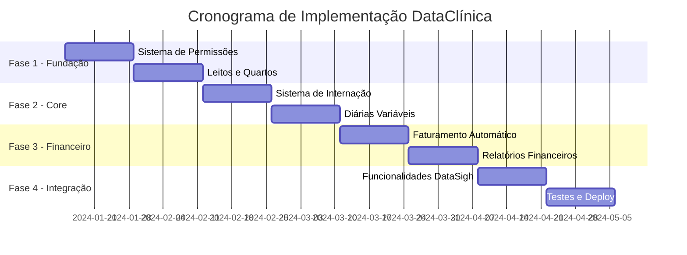

# Cronograma de Implementação - DataClínica
## Sistema Completo para Clínicas de Dependentes Químicos e Saúde Mental

---

## 1. Visão Geral do Projeto

### 1.1 Resumo Executivo
- **Duração Total**: 16 semanas (4 meses)
- **Equipe Recomendada**: 3-4 desenvolvedores
- **Metodologia**: Desenvolvimento Ágil (Sprints de 2 semanas)
- **Entregas**: 8 sprints com funcionalidades incrementais

### 1.2 Fases do Projeto

## 2. Detalhamento por Sprint

### Sprint 1 (Semanas 1-2): Sistema de Permissões Granulares
**Objetivo**: Implementar controle de acesso baseado em roles

#### Tarefas Técnicas:
- [ ] **Backend (40h)**
  - Criar modelos: `UserRole`, `Module`, `RolePermission`, `UserRoleAssignment`
  - Implementar middleware de autorização
  - Criar endpoints de gestão de roles
  - Implementar decoradores de permissão
  - Testes unitários do sistema de permissões

- [ ] **Frontend (32h)**
  - Componente de gestão de roles
  - Interface de atribuição de permissões
  - Guards de rota baseados em permissões
  - Componentes condicionais por permissão

- [ ] **Database (8h)**
  - Migration para tabelas de permissões
  - Seed data com roles padrão
  - Índices de performance

**Entregáveis**:
- ✅ Sistema completo de roles e permissões
- ✅ Interface administrativa para gestão de usuários
- ✅ Middleware de autorização funcionando

**Critérios de Aceite**:
- Apenas admins podem criar novos usuários
- Permissões granulares por módulo (CRUD)
- Interface intuitiva para gestão de roles

---

### Sprint 2 (Semanas 3-4): Sistema de Leitos e Quartos
**Objetivo**: Implementar gestão completa de leitos

#### Tarefas Técnicas:
- [ ] **Backend (36h)**
  - Modelos: `Department`, `Room`, `Bed`, `BedStatusHistory`
  - CRUD completo para leitos e quartos
  - Sistema de mudança de status com histórico
  - Endpoints de dashboard de ocupação
  - Cálculo de taxa de ocupação em tempo real

- [ ] **Frontend (36h)**
  - Dashboard de ocupação com gráficos
  - Grid visual de leitos com status colorido
  - Formulários de cadastro de quartos/leitos
  - Modal de mudança de status
  - Filtros por departamento e status

- [ ] **Database (8h)**
  - Migrations para estrutura de leitos
  - Dados iniciais (departamentos padrão)
  - Índices otimizados para consultas

**Entregáveis**:
- ✅ Sistema completo de gestão de leitos
- ✅ Dashboard visual de ocupação
- ✅ Controle de status com histórico

**Critérios de Aceite**:
- Visualização em tempo real da ocupação
- Mudança de status com rastreabilidade
- Relatórios de ocupação por período

---

### Sprint 3 (Semanas 5-6): Sistema de Internação
**Objetivo**: Implementar processo completo de internação

#### Tarefas Técnicas:
- [ ] **Backend (40h)**
  - Modelo `PatientAdmission` e `BedTransfer`
  - Processo de internação com validações
  - Sistema de alta com cálculos automáticos
  - Transferência entre leitos
  - Integração com sistema de leitos

- [ ] **Frontend (32h)**
  - Formulário de internação
  - Interface de seleção de leitos disponíveis
  - Processo de alta com validações
  - Histórico de internações do paciente
  - Dashboard de internações ativas

- [ ] **Integrações (8h)**
  - Atualização automática de status dos leitos
  - Notificações de internação/alta
  - Logs de auditoria

**Entregáveis**:
- ✅ Processo completo de internação
- ✅ Sistema de transferência de leitos
- ✅ Controle de altas com validações

**Critérios de Aceite**:
- Internação só em leitos disponíveis
- Cálculo automático de dias de internação
- Histórico completo por paciente

---

### Sprint 4 (Semanas 7-8): Sistema de Diárias Variáveis
**Objetivo**: Implementar configuração flexível de diárias

#### Tarefas Técnicas:
- [ ] **Backend (36h)**
  - Modelos: `DailyRateConfig`, `DailyRateTier`
  - Sistema de configuração por tipo de pagamento
  - Cálculo automático baseado em faixas de tempo
  - Validações de sobreposição de faixas
  - Histórico de alterações de valores

- [ ] **Frontend (36h)**
  - Interface de configuração de diárias
  - Wizard para criação de faixas
  - Simulador de cálculo de diárias
  - Relatórios de valores por tipo de pagamento
  - Validações em tempo real

- [ ] **Testes (8h)**
  - Testes de cálculo de diárias
  - Cenários de múltiplas faixas
  - Validação de regras de negócio

**Entregáveis**:
- ✅ Sistema flexível de configuração de diárias
- ✅ Cálculo automático por faixas de tempo
- ✅ Interface intuitiva de configuração

**Critérios de Aceite**:
- Configuração independente por tipo de pagamento
- Faixas: 1-30, 31-60, 61-90, 91-120 dias
- Cálculo automático e preciso

---

### Sprint 5 (Semanas 9-10): Faturamento Automático
**Objetivo**: Implementar sistema completo de faturamento

#### Tarefas Técnicas:
- [ ] **Backend (40h)**
  - Modelo `AdmissionBilling` e `BillingItem`
  - Cálculo automático baseado em dias de internação
  - Sistema de faturamento periódico
  - Integração com tipos de pagamento
  - Controle de pagamentos e pendências

- [ ] **Frontend (32h)**
  - Dashboard financeiro de internações
  - Relatórios de faturamento
  - Interface de controle de pagamentos
  - Geração de faturas em PDF
  - Alertas de vencimento

- [ ] **Integrações (8h)**
  - Job automático de faturamento
  - Notificações de cobrança
  - Integração com sistema contábil

**Entregáveis**:
- ✅ Faturamento automático por internação
- ✅ Controle de pagamentos e pendências
- ✅ Relatórios financeiros detalhados

**Critérios de Aceite**:
- Cálculo preciso baseado em dias e faixas
- Faturamento automático por período
- Controle de inadimplência

---

### Sprint 6 (Semanas 11-12): Relatórios e Analytics
**Objetivo**: Implementar sistema completo de relatórios

#### Tarefas Técnicas:
- [ ] **Backend (32h)**
  - Queries otimizadas para relatórios
  - Cálculos de KPIs (ocupação, receita, etc.)
  - Exportação em múltiplos formatos
  - Cache de relatórios pesados
  - APIs de dashboard executivo

- [ ] **Frontend (40h)**
  - Dashboard executivo com gráficos
  - Relatórios de ocupação por período
  - Análise financeira por tipo de pagamento
  - Relatórios de permanência média
  - Filtros avançados e drill-down

- [ ] **Performance (8h)**
  - Otimização de queries
  - Implementação de cache
  - Índices de performance

**Entregáveis**:
- ✅ Dashboard executivo completo
- ✅ Relatórios operacionais e financeiros
- ✅ Sistema de exportação

**Critérios de Aceite**:
- Relatórios em tempo real
- Múltiplos formatos de exportação
- Performance adequada (< 3s)

---

### Sprint 7 (Semanas 13-14): Funcionalidades DataSigh
**Objetivo**: Implementar funcionalidades identificadas no DataSigh

#### Funcionalidades Prioritárias:
- [ ] **Integração WhatsApp (24h)**
  - API WhatsApp Business
  - Notificações automáticas
  - Confirmação de consultas

- [ ] **Prescrição Digital (20h)**
  - Assinatura digital
  - Templates de prescrição
  - Integração com farmácia

- [ ] **PACS Básico (20h)**
  - Upload de exames
  - Visualizador básico
  - Integração com prontuário

- [ ] **Telemedicina Aprimorada (16h)**
  - Melhorias na interface
  - Gravação de consultas
  - Compartilhamento de tela

**Entregáveis**:
- ✅ Integração WhatsApp funcional
- ✅ Sistema de prescrição digital
- ✅ PACS básico implementado

**Critérios de Aceite**:
- Notificações automáticas via WhatsApp
- Prescrições com validade legal
- Visualização de exames integrada

---

### Sprint 8 (Semanas 15-16): Testes, Otimização e Deploy
**Objetivo**: Finalizar, testar e implantar o sistema

#### Tarefas Técnicas:
- [ ] **Testes (32h)**
  - Testes de integração completos
  - Testes de carga e performance
  - Testes de segurança
  - Testes de usabilidade
  - Correção de bugs identificados

- [ ] **Otimização (24h)**
  - Otimização de performance
  - Ajustes de UX/UI
  - Implementação de cache
  - Otimização de queries

- [ ] **Deploy e Documentação (24h)**
  - Configuração de produção
  - Documentação técnica
  - Manual do usuário
  - Treinamento da equipe
  - Go-live assistido

**Entregáveis**:
- ✅ Sistema completo testado e otimizado
- ✅ Documentação completa
- ✅ Sistema em produção

**Critérios de Aceite**:
- Todos os testes passando
- Performance adequada em produção
- Usuários treinados e sistema operacional

---

## 3. Recursos Necessários

### 3.1 Equipe Técnica

| Função | Quantidade | Dedicação | Custo/Mês |
|--------|------------|-----------|------------|
| Tech Lead/Arquiteto | 1 | 100% | R$ 15.000 |
| Desenvolvedor Backend | 1 | 100% | R$ 12.000 |
| Desenvolvedor Frontend | 1 | 100% | R$ 10.000 |
| Desenvolvedor Full-Stack | 1 | 100% | R$ 11.000 |
| QA/Tester | 1 | 50% | R$ 4.000 |
| **Total Mensal** | | | **R$ 52.000** |
| **Total Projeto (4 meses)** | | | **R$ 208.000** |

### 3.2 Infraestrutura

| Item | Custo Mensal | Custo Total |
|------|--------------|-------------|
| Servidor de Aplicação (AWS/Azure) | R$ 800 | R$ 3.200 |
| Banco de Dados PostgreSQL | R$ 600 | R$ 2.400 |
| Redis Cache | R$ 200 | R$ 800 |
| CDN e Storage | R$ 300 | R$ 1.200 |
| Monitoramento e Logs | R$ 400 | R$ 1.600 |
| **Total Infraestrutura** | **R$ 2.300** | **R$ 9.200** |

### 3.3 Ferramentas e Licenças

| Item | Custo Total |
|------|-------------|
| Licenças de Desenvolvimento | R$ 5.000 |
| Ferramentas de Design | R$ 2.000 |
| Ferramentas de Teste | R$ 3.000 |
| **Total Ferramentas** | **R$ 10.000** |

### 3.4 Resumo de Custos

| Categoria | Valor |
|-----------|-------|
| Equipe Técnica | R$ 208.000 |
| Infraestrutura | R$ 9.200 |
| Ferramentas | R$ 10.000 |
| **TOTAL PROJETO** | **R$ 227.200** |

---

## 4. Riscos e Mitigações

### 4.1 Riscos Técnicos

| Risco | Probabilidade | Impacto | Mitigação |
|-------|---------------|---------|----------|
| Complexidade do sistema de diárias | Média | Alto | Prototipagem antecipada, testes extensivos |
| Performance com muitos leitos | Baixa | Médio | Otimização de queries, cache, índices |
| Integração com sistemas externos | Média | Médio | APIs bem documentadas, testes de integração |
| Segurança de dados médicos | Baixa | Alto | Auditoria de segurança, criptografia |

### 4.2 Riscos de Projeto

| Risco | Probabilidade | Impacto | Mitigação |
|-------|---------------|---------|----------|
| Mudanças de escopo | Alta | Alto | Controle rigoroso de mudanças, documentação |
| Disponibilidade da equipe | Média | Médio | Equipe com overlap de conhecimentos |
| Atraso nas entregas | Média | Alto | Buffer de tempo, entregas incrementais |
| Problemas de comunicação | Baixa | Médio | Reuniões regulares, documentação clara |

---

## 5. Critérios de Sucesso

### 5.1 Métricas Técnicas
- ✅ 100% dos testes automatizados passando
- ✅ Performance < 3 segundos para operações críticas
- ✅ Disponibilidade > 99.5%
- ✅ Zero vulnerabilidades críticas de segurança

### 5.2 Métricas de Negócio
- ✅ Redução de 80% no tempo de internação manual
- ✅ Cálculo automático de 100% das diárias
- ✅ Relatórios de ocupação em tempo real
- ✅ Controle granular de permissões funcionando

### 5.3 Métricas de Usuário
- ✅ Satisfação do usuário > 4.5/5
- ✅ Tempo de treinamento < 4 horas por usuário
- ✅ Redução de 90% em erros de faturamento
- ✅ Interface responsiva em todos os dispositivos

---

## 6. Plano de Comunicação

### 6.1 Reuniões Regulares
- **Daily Standup**: Diário, 15 minutos
- **Sprint Planning**: Início de cada sprint, 2 horas
- **Sprint Review**: Final de cada sprint, 1 hora
- **Sprint Retrospective**: Final de cada sprint, 1 hora
- **Stakeholder Update**: Semanal, 30 minutos

### 6.2 Documentação
- **Especificações Técnicas**: Atualizadas a cada sprint
- **Manual do Usuário**: Desenvolvido incrementalmente
- **Relatórios de Progresso**: Semanais
- **Documentação de API**: Automática via Swagger

### 6.3 Canais de Comunicação
- **Slack/Teams**: Comunicação diária
- **Jira/Azure DevOps**: Gestão de tarefas
- **Confluence/Notion**: Documentação
- **GitHub/GitLab**: Código e versionamento

---

## 7. Plano de Contingência

### 7.1 Cenário: Atraso de 2 semanas
**Ações**:
- Priorizar funcionalidades core (leitos, internação, diárias)
- Postergar funcionalidades DataSigh para fase 2
- Adicionar 1 desenvolvedor temporário
- Reduzir escopo de relatórios avançados

### 7.2 Cenário: Problemas de Performance
**Ações**:
- Implementar cache agressivo
- Otimizar queries críticas
- Considerar sharding de dados
- Implementar paginação em todas as listas

### 7.3 Cenário: Mudanças Regulatórias
**Ações**:
- Manter arquitetura flexível
- Implementar sistema de configurações
- Documentar todas as regras de negócio
- Criar testes para validações regulatórias

---

## 8. Próximos Passos

### 8.1 Preparação (Semana 0)
- [ ] Aprovação do cronograma e orçamento
- [ ] Contratação/alocação da equipe
- [ ] Setup do ambiente de desenvolvimento
- [ ] Configuração das ferramentas de projeto
- [ ] Kick-off meeting com toda a equipe

### 8.2 Início do Desenvolvimento
- [ ] Sprint 1 Planning Meeting
- [ ] Setup dos repositórios de código
- [ ] Configuração de CI/CD
- [ ] Definição de padrões de código
- [ ] Início do desenvolvimento

### 8.3 Acompanhamento
- [ ] Reuniões semanais de progresso
- [ ] Revisões de código obrigatórias
- [ ] Testes automatizados em cada PR
- [ ] Deploy contínuo em ambiente de teste
- [ ] Feedback contínuo dos stakeholders

---

**Este cronograma foi elaborado considerando as especificidades de clínicas para dependentes químicos e saúde mental, garantindo que todas as funcionalidades críticas sejam implementadas com qualidade e dentro do prazo estabelecido.**