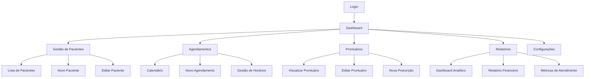

# DataClínica - Documento de Requisitos do Produto (PRD)

## 1. Visão Geral do Produto

O DataClínica é um sistema completo de gestão clínica SaaS multiempresa que permite a administração eficiente de clínicas médicas, consultórios e centros de saúde. O sistema oferece funcionalidades integradas para gestão de pacientes, agendamentos, prontuários eletrônicos, controle financeiro e relatórios analíticos.

O produto resolve os principais desafios de gestão clínica: organização de informações de pacientes, otimização de agendamentos, digitalização de prontuários e controle financeiro integrado. Destinado a clínicas de pequeno e médio porte que buscam modernizar seus processos e melhorar a eficiência operacional.

O objetivo é se tornar a principal plataforma de gestão clínica no mercado brasileiro, oferecendo uma solução completa, intuitiva e acessível.

## 2. Funcionalidades Principais

### 2.1 Perfis de Usuário

| Perfil        | Método de Registro          | Permissões Principais                                         |
| ------------- | --------------------------- | ------------------------------------------------------------- |
| Administrador | Registro inicial da clínica | Acesso completo ao sistema, gestão de usuários, configurações |
| Médico        | Convite do administrador    | Gestão de pacientes, agendamentos, prontuários, prescrições   |
| Recepcionista | Convite do administrador    | Agendamentos, cadastro de pacientes, relatórios básicos       |

### 2.2 Módulos Funcionais

Nosso sistema de gestão clínica consiste nas seguintes páginas principais:

1. **Dashboard**: métricas principais, gráficos de performance, atividades recentes, ações rápidas
2. **Gestão de Pacientes**: lista com filtros, formulários de cadastro/edição, prontuário eletrônico, upload de documentos
3. **Sistema de Agendamentos**: calendário interativo, formulários de agendamento, gestão de horários, notificações automáticas
4. **Gestão de Médicos**: cadastro de profissionais, especialidades, agenda pessoal, relatórios de atendimento
5. **Prontuário Eletrônico**: editor de prontuários, templates personalizáveis, histórico médico, prescrições digitais
6. **Relatórios e Analytics**: dashboard analítico, relatórios financeiros, métricas de atendimento, exportação de dados
7. **Configurações**: personalização da clínica, gestão de usuários, configurações de notificação, backup

### 2.3 Detalhes das Páginas

| Nome da Página          | Nome do Módulo               | Descrição da Funcionalidade                                                                             |
| ----------------------- | ---------------------------- | ------------------------------------------------------------------------------------------------------- |
| Dashboard               | Métricas Principais          | Exibir estatísticas em tempo real: pacientes ativos, consultas do dia, receita mensal, taxa de ocupação |
| Dashboard               | Gráficos de Performance      | Visualizar tendências de atendimento, faturamento e crescimento através de gráficos interativos         |
| Dashboard               | Atividades Recentes          | Listar últimos agendamentos, novos pacientes, consultas realizadas com timestamps                       |
| Dashboard               | Ações Rápidas                | Botões para novo paciente, agendar consulta, gerar relatório, acessar configurações                     |
| Gestão de Pacientes     | Lista de Pacientes           | Exibir tabela paginada com filtros por nome, CPF, data de nascimento, status                            |
| Gestão de Pacientes     | Formulário de Cadastro       | Criar/editar paciente com validação de CPF, campos obrigatórios, upload de foto                         |
| Gestão de Pacientes     | Prontuário do Paciente       | Visualizar histórico médico completo, consultas anteriores, documentos anexados                         |
| Gestão de Pacientes     | Upload de Documentos         | Anexar RG, CPF, carteirinha do convênio, exames com preview e organização por tipo                      |
| Sistema de Agendamentos | Calendário Interativo        | Visualizar agenda semanal/mensal com cores por médico, drag-and-drop para reagendar                     |
| Sistema de Agendamentos | Formulário de Agendamento    | Agendar consulta selecionando paciente, médico, data/hora com validação de conflitos                    |
| Sistema de Agendamentos | Gestão de Horários           | Configurar horários de funcionamento, intervalos, bloqueios por médico                                  |
| Sistema de Agendamentos | Notificações                 | Enviar lembretes automáticos por SMS/email, confirmações de agendamento                                 |
| Gestão de Médicos       | Cadastro de Médicos          | Registrar profissionais com CRM, especialidade, contatos, documentos                                    |
| Gestão de Médicos       | Agenda Pessoal               | Visualizar agenda individual do médico com filtros e exportação                                         |
| Gestão de Médicos       | Relatórios de Atendimento    | Gerar relatórios de produtividade, número de consultas, receita por médico                              |
| Prontuário Eletrônico   | Editor de Prontuários        | Criar/editar prontuários com editor rich text, templates pré-definidos                                  |
| Prontuário Eletrônico   | Templates Personalizáveis    | Configurar modelos de prontuário por especialidade com campos customizados                              |
| Prontuário Eletrônico   | Histórico Médico             | Visualizar cronologia completa de consultas, diagnósticos, tratamentos                                  |
| Prontuário Eletrônico   | Prescrições Digitais         | Gerar receitas médicas digitais com assinatura eletrônica, banco de medicamentos                        |
| Relatórios e Analytics  | Dashboard Analítico          | Exibir KPIs principais: faturamento, número de consultas, crescimento mensal                            |
| Relatórios e Analytics  | Relatórios Financeiros       | Gerar relatórios de receita, despesas, inadimplência com filtros por período                            |
| Relatórios e Analytics  | Métricas de Atendimento      | Analisar tempo médio de consulta, taxa de no-show, satisfação do paciente                               |
| Relatórios e Analytics  | Exportação de Dados          | Exportar relatórios em PDF/Excel com agendamento automático de envio                                    |
| Configurações           | Personalização da Clínica    | Configurar logo, cores, informações da clínica, dados de contato                                        |
| Configurações           | Gestão de Usuários           | Adicionar/remover usuários, definir permissões, resetar senhas                                          |
| Configurações           | Configurações de Notificação | Configurar templates de SMS/email, horários de envio, tipos de lembrete                                 |
| Configurações           | Backup e Restauração         | Configurar backups automáticos, restaurar dados, exportar informações                                   |

## 3. Fluxo Principal do Sistema

### Fluxo do Administrador

1. Login no sistema
2. Acesso ao dashboard com visão geral da clínica
3. Configuração inicial: dados da clínica, usuários, médicos
4. Gestão contínua: monitoramento de métricas, relatórios, configurações

### Fluxo do Recepcionista

1. Login no sistema
2. Cadastro de novos pacientes
3. Agendamento de consultas no calendário
4. Confirmação de chegada dos pacientes
5. Geração de relatórios básicos

### Fluxo do Médico

1. Login no sistema
2. Visualização da agenda do dia
3. Atendimento: acesso ao prontuário do paciente
4. Preenchimento do prontuário pós-consulta
5. Geração de prescrições e relatórios

## 4. Design da Interface do Usuário

### 4.1 Estilo de Design

* **Cores Primárias**: Azul médico (#2563EB), Verde saúde (#059669)

* **Cores Secundárias**: Cinza neutro (#6B7280), Branco (#FFFFFF)

* **Estilo de Botões**: Arredondados com sombra sutil, estados hover/active bem definidos

* **Tipografia**: Inter (títulos), Open Sans (corpo do texto), tamanhos 14px-24px

* **Layout**: Design limpo e minimalista, navegação lateral fixa, cards com bordas suaves

* **Ícones**: Lucide React, estilo outline, consistência visual em todo o sistema

### 4.2 Visão Geral do Design das Páginas

| Nome da Página          | Nome do Módulo            | Elementos da UI                                                                       |
| ----------------------- | ------------------------- | ------------------------------------------------------------------------------------- |
| Dashboard               | Métricas Principais       | Cards com ícones coloridos, números grandes, indicadores de tendência (↑↓)            |
| Dashboard               | Gráficos de Performance   | Gráficos de linha/barra com Chart.js, cores consistentes, tooltips informativos       |
| Dashboard               | Atividades Recentes       | Lista com avatars, timestamps relativos, badges de status coloridos                   |
| Gestão de Pacientes     | Lista de Pacientes        | Tabela responsiva com paginação, filtros dropdown, botões de ação (editar/visualizar) |
| Gestão de Pacientes     | Formulário de Cadastro    | Formulário em duas colunas, validação em tempo real, upload de imagem com preview     |
| Sistema de Agendamentos | Calendário Interativo     | Calendário full-screen, eventos coloridos por médico, modal para detalhes             |
| Sistema de Agendamentos | Formulário de Agendamento | Seletor de data/hora, autocomplete para pacientes, validação de conflitos             |
| Prontuário Eletrônico   | Editor de Prontuários     | Editor WYSIWYG, barra de ferramentas, templates em sidebar, auto-save                 |
| Relatórios e Analytics  | Dashboard Analítico       | Grid de KPIs, gráficos interativos, filtros de período, botões de exportação          |
| Configurações           | Gestão de Usuários        | Tabela de usuários, modal de edição, toggle de permissões, indicadores de status      |

### 4.3 Responsividade

O sistema é desenvolvido com abordagem mobile-first, garantindo experiência otimizada em:

* **Desktop**: Layout com sidebar fixa, aproveitamento completo da tela

* **Tablet**: Sidebar colapsável, reorganização de cards em grid responsivo

* **Mobile**: Navegação bottom tab, formulários em tela cheia, gestos touch otimizados

Breakpoints principais: 640px (sm), 768px (md), 1024px (lg), 1280px (xl)

## 5. Requisitos Técnicos

### 5.1 Performance

* Tempo de carregamento inicial < 3 segundos

* Navegação entre páginas < 1 segundo

* Suporte a 100+ usuários simultâneos por clínica

* Uptime de 99.9%

### 5.2 Segurança

* Criptografia de dados sensíveis (AES-256)

* Autenticação multifator opcional

* Logs de auditoria completos

* Compliance com LGPD

### 5.3 Compatibilidade

* Navegadores: Chrome 90+, Firefox 88+, Safari 14+, Edge 90+

* Dispositivos: Desktop, tablet, smartphone

* Sistemas: Windows, macOS, Linux, iOS, Android

## 6. Critérios de Aceitação

### 6.1 Funcionalidades Core

* ✅ Sistema de autenticação funcionando

* ✅ CRUD completo para pacientes, médicos e agendamentos

* ✅ Calendário interativo com drag-and-drop

* ✅ Editor de prontuários com templates

* ✅ Relatórios básicos com exportação

### 6.2 Interface e Usabilidade

* ✅ Design responsivo em todos os dispositivos

* ✅ Navegação intuitiva e consistente

* ✅ Feedback visual para todas as ações

* ✅ Carregamento rápido de páginas

* ✅ Acessibilidade básica (WCAG 2.1 AA)

### 6.3 Segurança e Compliance

* ✅ Isolamento de dados entre clínicas

* ✅ Backup automático diário

* ✅ Logs de auditoria implementados

* ✅ Termos de uso e política de privacidade

* ✅ Compliance com LGPD

## 7. Roadmap de Funcionalidades

### Fase 1 - MVP (8 semanas)

* Sistema de autenticação

* Gestão básica de pacientes

* Agendamentos simples

* Dashboard com métricas básicas

### Fase 2 - Funcionalidades Avançadas (4 semanas)

* Prontuário eletrônico completo

* Relatórios avançados

* Notificações automáticas

* Gestão de médicos

### Fase 3 - Otimizações (2 semanas)

* Performance e UX

* Funcionalidades premium

* Integrações externas

* Mobile app nativo

## 8. Métricas de Sucesso

### 8.1 Métricas de Produto

* Taxa de adoção: 80% dos usuários ativos semanalmente

* Tempo de onboarding: < 30 minutos para configuração inicial

* NPS (Net Promoter Score): > 50

* Taxa de retenção: > 90% após 3 meses

### 8.2 Métricas Técnicas

* Disponibilidade: 99.9% uptime

* Performance: < 2s tempo de resposta médio

* Bugs críticos: 0 em produção

* Cobertura de testes: > 80%

***

