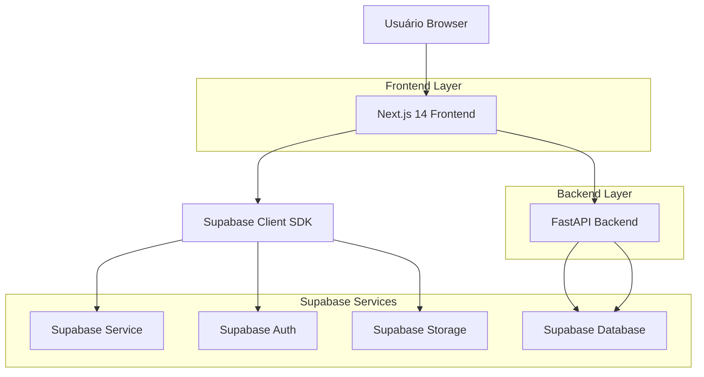
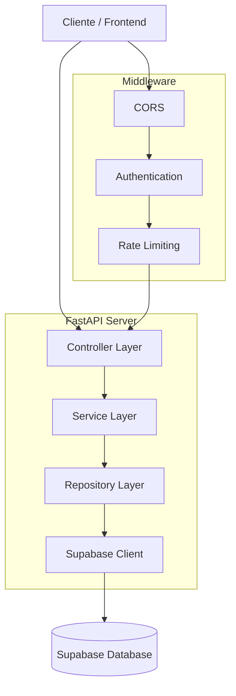
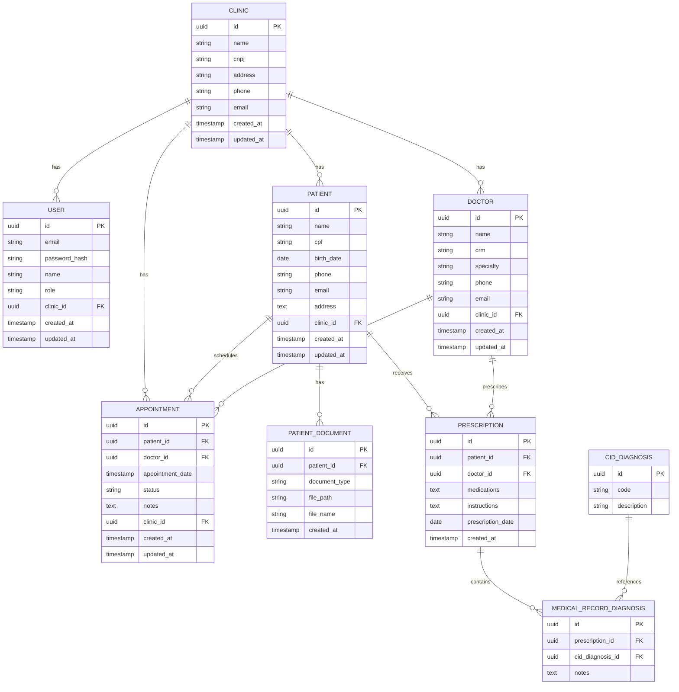

# DataClínica - Arquitetura Técnica

## 1. Arquitetura do Sistema



## 2. Descrição das Tecnologias

* **Frontend:** Next.js 14 + TypeScript + shadcn/ui + TailwindCSS

* **Backend:** FastAPI + Python + Supabase Python Client

* **Banco de Dados:** Supabase (PostgreSQL)

* **Autenticação:** Supabase Auth

* **Storage:** Supabase Storage

* **Deploy:** Vercel (frontend) + Railway/Render (backend)

## 3. Definições de Rotas Frontend

| Rota                | Propósito                                                   |
| ------------------- | ----------------------------------------------------------- |
| `/`                 | Página inicial com redirecionamento para login ou dashboard |
| `/login`            | Página de autenticação de usuários                          |
| `/register`         | Página de registro de novas clínicas                        |
| `/dashboard`        | Dashboard principal com métricas e visão geral              |
| `/patients`         | Lista e gestão de pacientes                                 |
| `/patients/[id]`    | Detalhes e prontuário do paciente                           |
| `/patients/new`     | Formulário de cadastro de novo paciente                     |
| `/appointments`     | Sistema de agendamentos e calendário                        |
| `/appointments/new` | Formulário de novo agendamento                              |
| `/doctors`          | Gestão de médicos e profissionais                           |
| `/doctors/[id]`     | Perfil e agenda do médico                                   |
| `/reports`          | Relatórios e análises da clínica                            |
| `/settings`         | Configurações da clínica e usuário                          |
| `/profile`          | Perfil do usuário logado                                    |

## 4. Definições de API Backend

### 4.1 APIs Core

**Autenticação**

```
POST /api/auth/login
```

Request:

| Param Name | Param Type | isRequired | Description      |
| ---------- | ---------- | ---------- | ---------------- |
| email      | string     | true       | Email do usuário |
| password   | string     | true       | Senha do usuário |

Response:

| Param Name    | Param Type | Description         |
| ------------- | ---------- | ------------------- |
| access\_token | string     | Token JWT de acesso |
| user          | object     | Dados do usuário    |
| clinic        | object     | Dados da clínica    |

**Gestão de Pacientes**

```
GET /api/patients
POST /api/patients
GET /api/patients/{id}
PUT /api/patients/{id}
DELETE /api/patients/{id}
```

**Gestão de Agendamentos**

```
GET /api/appointments
POST /api/appointments
GET /api/appointments/{id}
PUT /api/appointments/{id}
DELETE /api/appointments/{id}
```

**Gestão de Médicos**

```
GET /api/doctors
POST /api/doctors
GET /api/doctors/{id}
PUT /api/doctors/{id}
DELETE /api/doctors/{id}
```

### 4.2 Tipos TypeScript Compartilhados

```typescript
// Tipos de usuário
interface User {
  id: string;
  email: string;
  name: string;
  role: 'admin' | 'doctor' | 'receptionist';
  clinic_id: string;
  created_at: string;
  updated_at: string;
}

// Tipos de clínica
interface Clinic {
  id: string;
  name: string;
  cnpj: string;
  address: string;
  phone: string;
  email: string;
  created_at: string;
  updated_at: string;
}

// Tipos de paciente
interface Patient {
  id: string;
  name: string;
  cpf: string;
  birth_date: string;
  phone: string;
  email?: string;
  address: string;
  clinic_id: string;
  created_at: string;
  updated_at: string;
}

// Tipos de médico
interface Doctor {
  id: string;
  name: string;
  crm: string;
  specialty: string;
  phone: string;
  email: string;
  clinic_id: string;
  created_at: string;
  updated_at: string;
}

// Tipos de agendamento
interface Appointment {
  id: string;
  patient_id: string;
  doctor_id: string;
  appointment_date: string;
  status: 'scheduled' | 'confirmed' | 'completed' | 'cancelled';
  notes?: string;
  clinic_id: string;
  created_at: string;
  updated_at: string;
}
```

## 5. Arquitetura do Servidor



## 6. Modelo de Dados

### 6.1 Diagrama ER



### 6.2 DDL (Data Definition Language)

**Tabela de Clínicas**

```sql
-- Criar tabela clinics
CREATE TABLE clinics (
    id UUID PRIMARY KEY DEFAULT gen_random_uuid(),
    name VARCHAR(255) NOT NULL,
    cnpj VARCHAR(18) UNIQUE NOT NULL,
    address TEXT NOT NULL,
    phone VARCHAR(20) NOT NULL,
    email VARCHAR(255) NOT NULL,
    created_at TIMESTAMP WITH TIME ZONE DEFAULT NOW(),
    updated_at TIMESTAMP WITH TIME ZONE DEFAULT NOW()
);

-- RLS Policy
ALTER TABLE clinics ENABLE ROW LEVEL SECURITY;
CREATE POLICY "Users can only see their own clinic" ON clinics
    FOR ALL USING (id = auth.jwt() ->> 'clinic_id'::text);

-- Grants
GRANT SELECT ON clinics TO anon;
GRANT ALL PRIVILEGES ON clinics TO authenticated;
```

**Tabela de Usuários**

```sql
-- Criar tabela users
CREATE TABLE users (
    id UUID PRIMARY KEY DEFAULT gen_random_uuid(),
    email VARCHAR(255) UNIQUE NOT NULL,
    password_hash VARCHAR(255) NOT NULL,
    name VARCHAR(255) NOT NULL,
    role VARCHAR(20) DEFAULT 'receptionist' CHECK (role IN ('admin', 'doctor', 'receptionist')),
    clinic_id UUID REFERENCES clinics(id) ON DELETE CASCADE,
    created_at TIMESTAMP WITH TIME ZONE DEFAULT NOW(),
    updated_at TIMESTAMP WITH TIME ZONE DEFAULT NOW()
);

-- Índices
CREATE INDEX idx_users_clinic_id ON users(clinic_id);
CREATE INDEX idx_users_email ON users(email);

-- RLS Policy
ALTER TABLE users ENABLE ROW LEVEL SECURITY;
CREATE POLICY "Users can only see users from their clinic" ON users
    FOR ALL USING (clinic_id = (auth.jwt() ->> 'clinic_id')::uuid);

-- Grants
GRANT SELECT ON users TO anon;
GRANT ALL PRIVILEGES ON users TO authenticated;
```

**Tabela de Pacientes**

```sql
-- Criar tabela patients
CREATE TABLE patients (
    id UUID PRIMARY KEY DEFAULT gen_random_uuid(),
    name VARCHAR(255) NOT NULL,
    cpf VARCHAR(14) NOT NULL,
    birth_date DATE NOT NULL,
    phone VARCHAR(20) NOT NULL,
    email VARCHAR(255),
    address TEXT NOT NULL,
    clinic_id UUID REFERENCES clinics(id) ON DELETE CASCADE,
    created_at TIMESTAMP WITH TIME ZONE DEFAULT NOW(),
    updated_at TIMESTAMP WITH TIME ZONE DEFAULT NOW()
);

-- Índices
CREATE INDEX idx_patients_clinic_id ON patients(clinic_id);
CREATE INDEX idx_patients_cpf ON patients(cpf);
CREATE INDEX idx_patients_name ON patients(name);

-- RLS Policy
ALTER TABLE patients ENABLE ROW LEVEL SECURITY;
CREATE POLICY "Users can only see patients from their clinic" ON patients
    FOR ALL USING (clinic_id = (auth.jwt() ->> 'clinic_id')::uuid);

-- Grants
GRANT SELECT ON patients TO anon;
GRANT ALL PRIVILEGES ON patients TO authenticated;
```

**Tabela de Médicos**

```sql
-- Criar tabela doctors
CREATE TABLE doctors (
    id UUID PRIMARY KEY DEFAULT gen_random_uuid(),
    name VARCHAR(255) NOT NULL,
    crm VARCHAR(20) NOT NULL,
    specialty VARCHAR(255) NOT NULL,
    phone VARCHAR(20) NOT NULL,
    email VARCHAR(255) NOT NULL,
    clinic_id UUID REFERENCES clinics(id) ON DELETE CASCADE,
    created_at TIMESTAMP WITH TIME ZONE DEFAULT NOW(),
    updated_at TIMESTAMP WITH TIME ZONE DEFAULT NOW()
);

-- Índices
CREATE INDEX idx_doctors_clinic_id ON doctors(clinic_id);
CREATE INDEX idx_doctors_crm ON doctors(crm);

-- RLS Policy
ALTER TABLE doctors ENABLE ROW LEVEL SECURITY;
CREATE POLICY "Users can only see doctors from their clinic" ON doctors
    FOR ALL USING (clinic_id = (auth.jwt() ->> 'clinic_id')::uuid);

-- Grants
GRANT SELECT ON doctors TO anon;
GRANT ALL PRIVILEGES ON doctors TO authenticated;
```

**Tabela de Agendamentos**

```sql
-- Criar tabela appointments
CREATE TABLE appointments (
    id UUID PRIMARY KEY DEFAULT gen_random_uuid(),
    patient_id UUID REFERENCES patients(id) ON DELETE CASCADE,
    doctor_id UUID REFERENCES doctors(id) ON DELETE CASCADE,
    appointment_date TIMESTAMP WITH TIME ZONE NOT NULL,
    status VARCHAR(20) DEFAULT 'scheduled' CHECK (status IN ('scheduled', 'confirmed', 'completed', 'cancelled')),
    notes TEXT,
    clinic_id UUID REFERENCES clinics(id) ON DELETE CASCADE,
    created_at TIMESTAMP WITH TIME ZONE DEFAULT NOW(),
    updated_at TIMESTAMP WITH TIME ZONE DEFAULT NOW()
);

-- Índices
CREATE INDEX idx_appointments_clinic_id ON appointments(clinic_id);
CREATE INDEX idx_appointments_patient_id ON appointments(patient_id);
CREATE INDEX idx_appointments_doctor_id ON appointments(doctor_id);
CREATE INDEX idx_appointments_date ON appointments(appointment_date);

-- RLS Policy
ALTER TABLE appointments ENABLE ROW LEVEL SECURITY;
CREATE POLICY "Users can only see appointments from their clinic" ON appointments
    FOR ALL USING (clinic_id = (auth.jwt() ->> 'clinic_id')::uuid);

-- Grants
GRANT SELECT ON appointments TO anon;
GRANT ALL PRIVILEGES ON appointments TO authenticated;
```

**Dados Iniciais**

```sql
-- Inserir clínica de exemplo
INSERT INTO clinics (name, cnpj, address, phone, email) VALUES
('Clínica Exemplo', '12.345.678/0001-90', 'Rua das Flores, 123', '(11) 99999-9999', 'contato@clinicaexemplo.com.br');

-- Inserir usuário admin
INSERT INTO users (email, password_hash, name, role, clinic_id) VALUES
('admin@dataclinica.com.br', '$2b$12$hash_da_senha', 'Administrador', 'admin', 
 (SELECT id FROM clinics WHERE cnpj = '12.345.678/0001-90'));
```

## 7. Configurações de Segurança

### 7.1 Row Level Security (RLS)

* Todas as tabelas principais têm RLS habilitado

* Políticas baseadas no `clinic_id` do usuário autenticado

* Isolamento completo de dados entre clínicas

### 7.2 Autenticação

* Supabase Auth para gerenciamento de sessões

* JWT tokens com claims customizados

* Refresh tokens automáticos

### 7.3 Permissões

* Role `anon`: Acesso básico de leitura

* Role `authenticated`: Acesso completo aos dados da própria clínica

* Validação de permissões no backend

## 8. Considerações de Performance

### 8.1 Índices de Banco

* Índices em chaves estrangeiras

* Índices em campos de busca frequente

* Índices compostos para queries complexas

### 8.2 Cache

* Cache de dados estáticos no frontend

* Cache de sessão do usuário

* Invalidação automática de cache

### 8.3 Otimizações

* Lazy loading de componentes

* Paginação de listas

* Compressão de imagens

* Bundle splitting no Next.js

